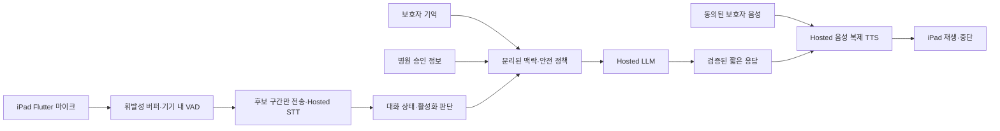

# 아키텍처 방향

클라우드 중심 MVP의 제품 흐름은 [ADR-0001](decisions/0001-cloud-first-familiar-voice-mvp.md), [iPad·Vercel 우선 결정 ADR-0002](decisions/0002-ipad-local-audio-vercel-first.md)와 [PRD](../docs/Delirium_Familiar_Voice_MVP_PRD.md)에 기록합니다. 아래는 구현 목표 흐름이며 hosted STT·LLM·TTS 제공업체가 확정됐다는 뜻은 아닙니다.

## MVP 목표 흐름



## 설계 원칙

1. **정보 경계**: 보호자 기억과 병원 승인 정보를 분리하고 출처·유효기간을 확인합니다.
2. **메시지 보존**: 병원 원문은 임의로 재작성하지 않고, 의료 판단을 생성하지 않습니다.
3. **주변 음성 최소화**: 상시 감지와 상시 녹음을 구분하고 전송·저장·폐기를 [안전 게이트](../docs/delirium-familiar-voice/07-pre-patient-trial-safety-ethics-gate.md)에서 확정합니다.
4. **정체성·거부 존중**: 실제 가족 통화로 속이지 않고 환자 거부 시 대화를 중단합니다.
5. **장애와 알림의 진실성**: 의료진 알림 생성·전달·확인을 구분하며 기존 호출 수단을 대체하지 않습니다.

## 검증 순서

### 1. 내부 기능 검증

- 합성 데이터로 STT→짧은 응답→음성 합성 연결
- 한국어 명료도, 지연 시간, 주변 음성 오활성화 측정
- 가족·병원 맥락 분리와 메시지 원문 보존 확인

### 2. 환자 시험 전 검토

- 정체성 고지, 동의·철회, 병실 음성 처리·제공업체 정책 확정
- 의료진 보조 알림의 전달·확인·실패 경로와 기존 호출 수단 안내 검증
- 기관의 임상·연구윤리 검토

### 3. 감독된 환자 시험

- 앞의 안전 게이트가 모두 완료된 경우에만 시작
- 안전 사건, 사용성 및 기능 지표를 분리해 평가

## 결정 기록

기술·제품 정책은 기존 [ADR 폴더](decisions/README.md)에 기록합니다. 현재 결정은 [ADR-0001 클라우드 중심 전환](decisions/0001-cloud-first-familiar-voice-mvp.md)과 [ADR-0002 iPad·Vercel 우선 경로](decisions/0002-ipad-local-audio-vercel-first.md)입니다.

## 자동 생성 구조도

생성기는 `src/kof5_tts/`의 Python 모듈과 내부 import, `configs/`의 설정 파일, `scripts/`의 실행 도구를 읽고, 정해진 MVP 목표 흐름을 함께 출력합니다. 현재 코드 목록과 구현 목표를 구분해 읽어야 합니다.

- `generated/catalog.json`: 도구가 읽을 수 있는 전체 카탈로그
- `generated/project-map.md`: 사람이 읽는 프로젝트 구조와 모듈 목록
- `generated/project-map.mmd`: 별도로 렌더링할 수 있는 Mermaid 원본

생성:

```bash
python3 scripts/generate_architecture.py
```

커밋된 결과가 현재 구조와 같은지 확인:

```bash
python3 scripts/generate_architecture.py --check
python3 -m unittest scripts/test_generate_architecture.py
```

`architecture/generated/` 파일은 직접 수정하지 않습니다. 코드·설정이나 생성기를 변경한 뒤 다시 생성합니다. 현재 생성기는 정적 Python import와 정해진 폴더 경계만 다루며, 동적 연결과 실제 제공업체 동작은 별도 검증이 필요합니다.
