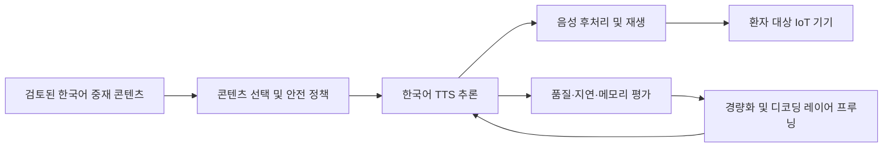

# 아키텍처 초안

현재 문서는 구현 확정안이 아니라 향후 설계를 위한 경계와 검토 순서를 정의합니다.

## 예상 처리 흐름

## 설계 원칙

1. **콘텐츠와 합성 엔진 분리**: 임상 검토를 받은 문구의 버전과 TTS 모델 버전을 독립적으로 추적합니다.
2. **안전 우선**: 생성 품질이 낮거나 기기 상태가 불안정할 때의 재생 차단·대체 동작을 설계합니다.
3. **측정 후 최적화**: 기준 모델의 품질, 지연 시간, 메모리와 전력을 측정한 뒤 경량화를 진행합니다.
4. **재현 가능한 변환**: 프루닝, 양자화, 변환 과정과 입력 모델의 버전을 기록합니다.
5. **온디바이스 경계 명시**: 로컬 처리와 서버 처리의 범위는 데이터 정책과 목표 하드웨어가 확정된 뒤 결정합니다.

## 단계별 방향

### 1. 기준선 구축

- 한국어 TTS 후보와 라이선스 검토
- 대표 문장 세트 및 평가 방법 정의
- 품질, 실시간 계수, 최대 메모리 사용량 측정

### 2. 경량화 실험

- 모델 형식 변환과 양자화 후보 비교
- 디코딩 레이어별 중요도 및 프루닝 민감도 측정
- 원본 대비 한국어 명료도와 핵심 문구 보존 검증

### 3. IoT 배포

- 목표 기기와 추론 런타임 확정
- 저장공간, 메모리, 전력 및 발열 예산 검증
- 오프라인 동작, 업데이트, 장애 복구와 관측 방법 설계

## 결정 기록

기술 선택은 [decisions/README.md](decisions/README.md)의 ADR 형식으로 기록합니다. 첫 ADR은 TTS 기준 모델이나 목표 하드웨어처럼 비교가 필요한 결정이 생겼을 때 작성합니다.
