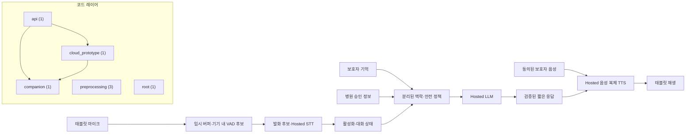

# 자동 생성 프로젝트 구조도

이 파일은 `scripts/generate_architecture.py`가 코드·설정 목록과 정해진 MVP 목표 흐름에서 생성합니다. 구조도는 구현 완료를 뜻하지 않습니다. 직접 수정하지 않습니다.

## 현재 카탈로그

- Python 모듈: **7**
- 설정 파일: **0**
- 프로젝트 실행 스크립트: **6**

### Python 모듈

| Module | Layer | Path | Internal imports |
| --- | --- | --- | --- |
| `kof5_tts` | root | `src/kof5_tts/__init__.py` | — |
| `kof5_tts.api` | api | `src/kof5_tts/api.py` | `kof5_tts.cloud_prototype` `kof5_tts.companion` |
| `kof5_tts.cloud_prototype` | cloud_prototype | `src/kof5_tts/cloud_prototype.py` | `kof5_tts.companion` |
| `kof5_tts.companion` | companion | `src/kof5_tts/companion.py` | — |
| `kof5_tts.preprocessing` | preprocessing | `src/kof5_tts/preprocessing/__init__.py` | `kof5_tts.preprocessing.audio` |
| `kof5_tts.preprocessing.aihub` | preprocessing | `src/kof5_tts/preprocessing/aihub.py` | — |
| `kof5_tts.preprocessing.audio` | preprocessing | `src/kof5_tts/preprocessing/audio.py` | — |

### 설정 파일

아직 확정된 설정 파일이 없습니다.

### 실행 스크립트

| Path |
| --- |
| `scripts/convert_wav_to_flac.py` |
| `scripts/demo_cloud_pipeline.py` |
| `scripts/demo_companion_text.py` |
| `scripts/download_aihub.py` |
| `scripts/run_backend.py` |
| `scripts/run_preprocessing_pipeline.py` |

## 분석 한계

- Python의 정적 import만 분석합니다.
- 동적 import와 런타임 모델 연결은 수동 검토가 필요합니다.
- 데이터와 체크포인트 내용은 안전을 위해 읽거나 목록화하지 않습니다.
