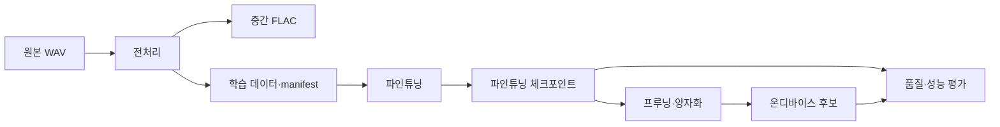

# 자동 생성 프로젝트 구조도

이 파일은 `scripts/generate_architecture.py`가 코드와 설정 구조에서 생성합니다. 직접 수정하지 않습니다.

## 현재 카탈로그

- Python 모듈: **0**
- 설정 파일: **0**
- 프로젝트 실행 스크립트: **0**

### Python 모듈

아직 구현된 Python 모듈이 없습니다.

### 설정 파일

아직 확정된 설정 파일이 없습니다.

### 실행 스크립트

아직 프로젝트 실행 스크립트가 없습니다.

## 분석 한계

- Python의 정적 import만 분석합니다.
- 동적 import와 런타임 모델 연결은 수동 검토가 필요합니다.
- 데이터와 체크포인트 내용은 안전을 위해 읽거나 목록화하지 않습니다.
