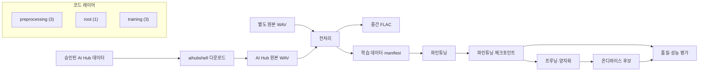

# 자동 생성 프로젝트 구조도

이 파일은 `scripts/generate_architecture.py`가 코드와 설정 구조에서 생성합니다. 직접 수정하지 않습니다.

## 현재 카탈로그

- Python 모듈: **7**
- 설정 파일: **3**
- 프로젝트 실행 스크립트: **5**

### Python 모듈

| Module | Layer | Path | Internal imports |
| --- | --- | --- | --- |
| `kof5_tts` | root | `src/kof5_tts/__init__.py` | — |
| `kof5_tts.preprocessing` | preprocessing | `src/kof5_tts/preprocessing/__init__.py` | `kof5_tts.preprocessing.audio` |
| `kof5_tts.preprocessing.aihub` | preprocessing | `src/kof5_tts/preprocessing/aihub.py` | — |
| `kof5_tts.preprocessing.audio` | preprocessing | `src/kof5_tts/preprocessing/audio.py` | — |
| `kof5_tts.training` | training | `src/kof5_tts/training/__init__.py` | — |
| `kof5_tts.training.param_groups` | training | `src/kof5_tts/training/param_groups.py` | — |
| `kof5_tts.training.vocab` | training | `src/kof5_tts/training/vocab.py` | — |

### 설정 파일

| Group | Path |
| --- | --- |
| finetuning | `configs/finetuning/stage1_text_only.yaml` |
| finetuning | `configs/finetuning/stage2_text_shallow_dit.yaml` |
| finetuning | `configs/finetuning/stage3_full.yaml` |

### 실행 스크립트

| Path |
| --- |
| `scripts/convert_wav_to_flac.py` |
| `scripts/download_aihub.py` |
| `scripts/extend_vocab.py` |
| `scripts/finetune_f5.py` |
| `scripts/run_preprocessing_pipeline.py` |

## 분석 한계

- Python의 정적 import만 분석합니다.
- 동적 import와 런타임 모델 연결은 수동 검토가 필요합니다.
- 데이터와 체크포인트 내용은 안전을 위해 읽거나 목록화하지 않습니다.
